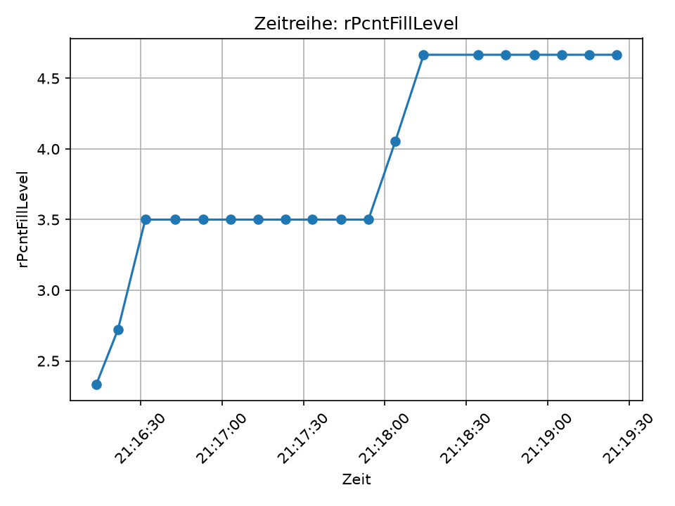

# IIoT-Projekt – Automatisierungstechnik

## 1. Ziel des Projekts

Ziel des Projekts ist der Aufbau einer IIoT-Datenpipeline für die Learning Factory. Sensordaten werden von der SPS über MQTT veröffentlicht, mit Python empfangen, gespeichert und visualisiert.

Die Umsetzung besteht aus vier Teilen:

| Aufgabe | Inhalt |
|---|---|
| 12.1.1 | MQTT-Client in TwinCAT SPS |
| 12.1.2 | Python-Datenspeicherung und Visualisierung |
| Zusatz| tinyDB als Zusatzdatenbank, System ist durch config-Datei konfigurierbar|

## 2. MQTT-Kommunikation

Die SPS veröffentlicht Messdaten über MQTT an den vorgegebenen Broker.

| Parameter | Wert |
|---|---|
| Broker | `158.180.44.197` |
| Port | `1883` |
| Benutzer | `bobm` |
| Passwort | `letmein` |

Verwendetes Topic-Schema:

    aut/SoSe26/<Gruppe>/$groupsname
    aut/SoSe26/<Gruppe>/names
    aut/SoSe26/<Gruppe>/<Messgröße>
    aut/SoSe26/<Gruppe>/<Messgröße>/$unit

Beispiel:

    aut/SoSe26/gruppe_test/iFillLevel1
    aut/SoSe26/gruppe_test/iFillLevel1/$unit

Die Metadaten wie Gruppenname, Namen und Einheiten werden mit `retain=True` veröffentlicht.

## 3. Python-Datenspeicherung

Für die Datenspeicherung wurde ein Python-MQTT-Subscriber umgesetzt.

Datei:

    mqtt_logger.py

Der Subscriber abonniert alle Topics der eigenen Gruppe.

Jede empfangene MQTT-Nachricht wird in einer CSV-Datei und zusätzlich in TinyDB gespeichert.

CSV-Datei:

    data/mqtt_data.csv

TinyDB-Datei:

    data/tinydb.json

Die CSV-Datei enthält folgende Spalten:

    timestamp,unix_ms,topic,measurement,payload_raw,value,is_numeric,qos,retain

Bedeutung der wichtigsten Spalten:

| Spalte | Bedeutung |
|---|---|
| `timestamp` | Zeitpunkt des Empfangs |
| `topic` | vollständiges MQTT-Topic |
| `measurement` | Messgröße |
| `payload_raw` | empfangener Rohwert |
| `value` | numerischer Wert, falls möglich |
| `is_numeric` | gibt an, ob der Wert numerisch ist |
| `retain` | gibt an, ob die Nachricht retained war |

## 4. Visualisierung

Die gespeicherten Messdaten werden mit matplotlib visualisiert.

Datei:

    plot_rPcntFillLevel.py

Für die Visualisierung wird eine Messgröße ausgewählt und als Zeitreihe dargestellt.

Verwendete Messgröße ist rPcntFillLevel, sie stellt den gesamt, abgfüllte Menge da:

    rPcntFillLevel

Das grundsätzliche Empfangen, Speichern und Plotten der MQTT-Messwerte hat funktioniert. 
Allerdings wurde die Messgröße über einen kürzeren Zeitraum als gefordert dargestellt.

Der erzeugte Plot dient daher hauptsächlich als Funktionsnachweis der Datenpipeline und nicht als inhaltlich aussagekräftige Prozessauswertung.

## 8. Fazit

Der Python-Teil der IIoT-Datenpipeline wurde erfolgreich umgesetzt. MQTT-Daten können empfangen, in CSV und TinyDB gespeichert und anschließend als Zeitreihe visualisiert werden.

Zusätzlich ist das Python-System über eine `config.json` konfigurierbar. Darin werden unter anderem MQTT-Broker, Port, Benutzername, Passwort, Gruppe, Basistopic sowie die Speicherpfade für CSV und TinyDB festgelegt.

Das Senden von Messgrößen über MQTT sowie das Speichern und Plotten mit Python hat prinzipiell funktioniert. 

## 9. KI-Nutzung

Bei der Strukturierung des Codes, der Fehlersuche und der Erstellung des Reports wurde KI unterstützend verwendet. Die Inhalte wurden überprüft und im Projekt getestet.
